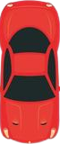
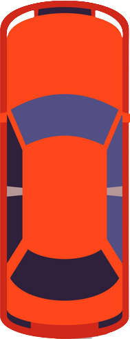
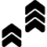

#                                    Self Driving Cars -Simulation
##  Overview:
To make a self driving car using Genetic Algorithm.
This is a Javascript Web based genentic algorithm. 

Each round consist of 100 cars and timer of 30 seconds , All Car which moves random at the start. As It Finds the path and overcomes the hurdles the score of each car increases with respect to its "Y" distance value 

As the Generation increases More precise and accurate cars are considered.

The Hurdels are traffic cars and the road

### Traffic Cars

### The Training Car 

## Key Points:
The controls are made up of neural networks of 2 levels of feed forward algorithm .Each Level consider of Input ,Biases, Weight, Output.
Input-the Value can be ranged from 0 to -1 and this is given by the sensors of the car .
Biases -This value is ranged from  -1 to 1 and taken randomly
Weights -This value is ranged from  -1 to 1 and taken randomly
Output - It is the Final most part which has 4 options to move up,down,left,right. 

## Controls :
Each Generation of cars can be controlled with  Number of sensors, Mutation Level,Fitness Function to use Total Number of population.

Sensor are the input to the neural network which is calculated by the distance between the hurdle and the car and Normalized  in 0 to -1.
Fitness Function are used to select the best car from the population. The Selection can be have 2 Function.

## Fitness Function
###      1.Top most Y distance (Y Distance):
    This uses the the distance travelled by the car to select the best car.
    This Converts the "y" value of the sreen resolution to a postive value and then the maximum of "y" value respect to each car is considered and best car is selected after each generation

###      2.Top Most Score (Score):
    This uses the top Score to select the best car. This is Calculate by using the  top most y distance and the number of takeovers. This Makes that the car doesn't stand at one place  behind a hurdle. This is an advance version of the 1st fitness function .This fitness function helps to create and select the best car which are better in overtaking and reach the destination faster with the help of score.

### Take over
